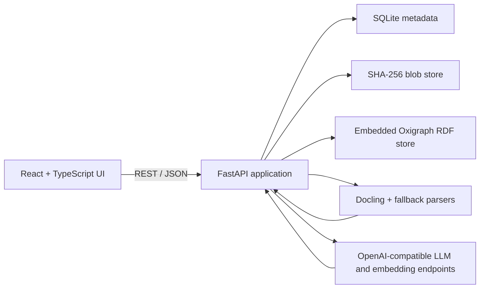

<div align="center">

# OntoPilot

**Turn documents into reviewable, traceable ontologies.**

OntoPilot is a local-first workbench for extracting, curating, validating, and publishing
RDF/OWL knowledge models from documents with human-in-the-loop AI assistance.

[English](README.md) · [简体中文](README.zh-CN.md)


</div>

## Overview

OntoPilot converts source documents into a curated ontology rather than a one-shot LLM output.
It combines structure-aware document parsing, schema and instance extraction, semantic retrieval,
specialized review agents, provenance tracking, manual editing, and reversible change history in
one self-hosted application.

The application stores documents, metadata, and ontology graphs locally. Selected document chunks
and ontology context are sent only to the OpenAI-compatible model endpoints configured by the
administrator.

## Highlights

| Area | Capabilities |
| --- | --- |
| Document ingestion | PDF, Word, Excel, Markdown, CSV, and text; content-addressed storage; virtual folders |
| Structure-aware chunking | Native Docling hierarchy and table-aware chunking with lightweight parser fallbacks |
| TBox extraction | Classes, subclass relations, object properties, data properties, domains, ranges, and axioms |
| ABox extraction | Individuals, types, object assertions, data assertions, and source evidence |
| Agentic assistance | Ontology retrieval, entity resolution, domain/range reconciliation, conflict triage, validation, and isolated-class attachment |
| Human review | Dedicated queues for ontology conflicts, entity resolution, and datatype validation |
| Provenance | Every extracted axiom and fact links back to its source document and chunk |
| Ontology workbench | Hierarchy browser, focused neighborhood graph, full graph, inspectors, tables, and LaTeX-rendered axioms |
| Governance | Per-knowledge-system owner/editor/viewer roles, audit history, and graph-scoped rollback |
| Interoperability | RDF/OWL export as Turtle, RDF/XML, N-Triples, or JSON-LD |

## Architecture



Each knowledge system owns two Oxigraph named graphs:

- a **TBox graph** for classes, properties, and schema axioms;
- an **ABox graph** for individuals and assertions.

SQLite stores relational metadata such as users, permissions, documents, chunks, extraction jobs,
provenance, conflicts, learned review decisions, and audit events. Original files are stored once by
SHA-256 under a sharded local blob directory.

## Typical Workflow

1. Create a knowledge system and choose its model endpoints.
2. Upload and organize source documents.
3. Parse documents into structure-aware chunks.
4. Extract the schema, instances, or both as a background job.
5. Review conflicts, ambiguous entity matches, and validation findings.
6. Explore and edit the ontology in the workbench.
7. Trace entities and assertions back to their source documents.
8. Export the curated graph or roll back a previous graph-changing event.

## Quick Start with Docker

### Prerequisites

- Docker Engine with Docker Compose
- An OpenAI-compatible API key, such as an OpenRouter key

### Start

```bash
git clone https://github.com/deeplethe/ontopilot.git
cd ontopilot
cp backend/.env.example backend/.env
```

On PowerShell, use:

```powershell
Copy-Item backend/.env.example backend/.env
```

Edit `backend/.env` and set at least:

```dotenv
OPENROUTER_API_KEY=sk-or-v1-your-key
ADMIN_USERNAME=admin
ADMIN_PASSWORD=replace-with-a-strong-password
```

Then start the application:

```bash
docker compose up -d --build
```

Open <http://localhost:8080> and sign in with the administrator account from `backend/.env`.

To stop the services without deleting persisted data:

```bash
docker compose down
```

Runtime data is stored in the `ontopilot-data` Docker volume.

The base Docker image uses the lightweight fallback parsers to keep the image compact. To enable
Docling's hierarchy- and table-aware pipeline in Docker, add the optional Docling dependencies to a
custom backend image before rebuilding.

## Local Development

### Requirements

- Python 3.12+
- Node.js 22+
- pnpm
- An OpenAI-compatible API key

### Backend

```powershell
cd backend
python -m venv .venv
.venv\Scripts\Activate.ps1
pip install -r requirements.txt
```

Docling is optional in the base environment. Install it for hierarchy- and table-aware parsing:

```powershell
pip install "docling>=2.118,<3" "docling-core[chunking]>=2.90,<3"
```

Copy and configure the environment file:

```powershell
Copy-Item .env.example .env
```

Start the API:

```powershell
uvicorn app.main:app --host 127.0.0.1 --port 8000 --reload
```

- Health check: <http://127.0.0.1:8000/api/health>
- OpenAPI documentation: <http://127.0.0.1:8000/docs>

### Frontend

```powershell
cd frontend
pnpm install
pnpm dev
```

The development server runs at <http://localhost:5173> and proxies `/api` to the backend.

### Validation Commands

```powershell
# Backend syntax validation
cd backend
.venv\Scripts\python.exe -m compileall -q app

# Frontend validation
cd ..\frontend
pnpm lint
pnpm build
```

## Configuration

Configuration is loaded from `backend/.env`. Model endpoints can also be managed at runtime by an
administrator and overridden per knowledge system.

| Variable | Default | Description |
| --- | --- | --- |
| `OPENROUTER_API_KEY` | empty | API key for the default OpenRouter connection |
| `OPENROUTER_BASE_URL` | `https://openrouter.ai/api/v1` | Default OpenAI-compatible base URL |
| `LLM_EXTRACT_MODEL` | `deepseek/deepseek-chat` | Default extraction and agent model |
| `EMBEDDING_MODEL` | `baai/bge-m3` | Default multilingual embedding model |
| `LLM_TEMPERATURE` | `0.1` | Model sampling temperature |
| `LLM_MAX_TOKENS` | `4000` | Maximum completion tokens |
| `CHUNK_SIZE_TOKENS` | `900` | Docling HybridChunker token budget |
| `EXTRACTION_MODE` | `auto` | `rag`, `agentic`, or automatic selection |
| `EXTRACTION_CONCURRENCY` | `5` | Maximum concurrent chunk extractions per job |
| `ADMIN_USERNAME` | `admin` | Administrator seeded into an empty database |
| `ADMIN_PASSWORD` | `admin` | Initial administrator password; always override it |
| `COOKIE_SECURE` | `false` | Set to `true` behind HTTPS |
| `CORS_ORIGINS` | local Vite origins | JSON list of allowed browser origins |

See `backend/app/config.py` for all advanced agent and validation settings.

## Extraction Modes

- **RAG** retrieves relevant ontology entities and neighborhoods, then performs one extraction call.
- **Agentic** allows the model to search the ontology and inspect neighborhoods through a bounded
  tool loop before producing an ontology delta.
- **Auto** uses agentic extraction once the ontology reaches the configured class threshold and RAG
  for smaller graphs.

TBox chunks are processed concurrently. Graph writes are serialized so extraction remains atomic,
progress stays queryable, and rollback diffs remain consistent.

## Provenance and Safe Deletion

OntoPilot treats an ontology as a merged artifact. The same axiom or fact can be supported by
multiple documents or by a manual edit.

Before deleting a document, the application computes its impact and identifies facts supported only
by that document. Users must confirm those retractions. Shared or manually created facts are kept.
This prevents both accidental graph loss and unsupported orphan facts.

## Data and Privacy

Local runtime state lives under `backend/data/` during development:

```text
backend/data/
├── blobs/          # content-addressed source files
├── ontopilot.db    # SQLite metadata, users, jobs, provenance, and audit history
└── oxigraph/       # persistent RDF named graphs
```

This directory and `backend/.env` are ignored by Git.

Important privacy considerations:

- selected source chunks and ontology context are sent to configured model providers;
- provider API keys are stored server-side and are never returned unmasked by the API;
- use HTTPS and `COOKIE_SECURE=true` for any non-local deployment;
- back up SQLite, blobs, and Oxigraph together to preserve cross-store consistency.

## Deployment Scope

The current release is designed for a single self-hosted backend instance. SQLite, embedded
Oxigraph, in-process background jobs, and graph write locks are intentionally optimized for a
local-first deployment. Horizontal scaling and durable distributed job execution are not yet
supported.

## Repository Layout

```text
ontopilot/
├── backend/
│   ├── app/api/          # FastAPI routes
│   ├── app/db/           # SQLModel metadata and migrations
│   ├── app/llm/          # OpenAI-compatible model client
│   ├── app/ontology/     # RDF storage, extraction, agents, validation, provenance
│   ├── app/parsing/      # Docling integration and fallback chunking
│   ├── app/storage/      # content-addressed blob store
│   └── scripts/          # evaluation and stress utilities
├── frontend/
│   └── src/              # React application, pages, components, and typed API client
└── docker-compose.yml
```

## Roadmap

- Automated backend, frontend, and end-to-end test suites
- Durable extraction workers and restartable jobs
- Versioned database migrations
- Stricter OWL-DL reasoning integration
- Direct graph-edge authoring in the visual workbench
- Reproducible Python dependency locking and published container images

## Contributing

The repository is currently maintained as a private preview under the DeepLethe organization.
Contribution guidelines, issue templates, and the public governance model will be added before the
repository is opened to external contributors.

## License

No public open-source license has been selected yet. The current repository is all-rights-reserved
and must not be redistributed. Replace `LICENSE` with the selected open-source license before making
the repository public.

## Acknowledgements

OntoPilot builds on FastAPI, React, Docling, Oxigraph, RDFLib, pySHACL, and the broader RDF/OWL
ecosystem.
