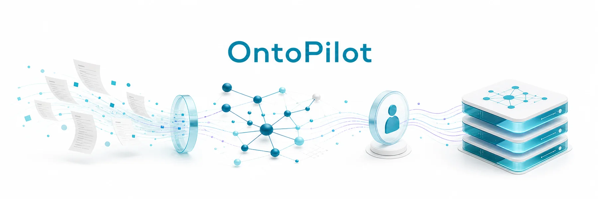
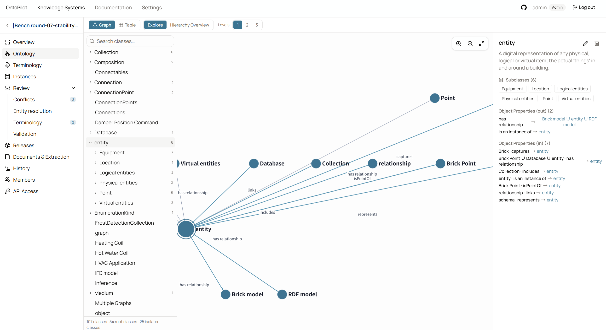
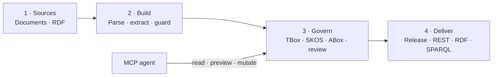
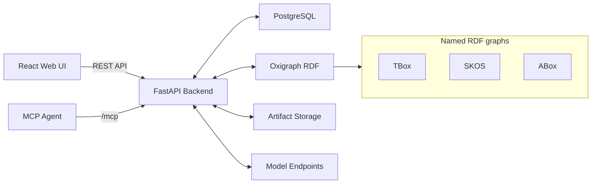

<div align="center">

# OntoPilot

**Human-governed ontology engineering from source documents.**

Build, review, version, publish, and serve TBox, SKOS terminology, and ABox data from one self-hosted workspace.

[简体中文](README.zh-CN.md) · [Documentation](#documentation) · [Architecture](docs/architecture.md) · [Roadmap](ROADMAP.md) · [Contributing](CONTRIBUTING.md) · [Code of Conduct](CODE_OF_CONDUCT.md) · [Security](SECURITY.md)

[](LICENSE)




</div>

> [!IMPORTANT]
> OntoPilot is under active development and has not reached 1.0. Back up PostgreSQL, the OntoPilot data volume, and your token-encryption key before upgrades. Review release notes and validate migrations on a copy of production data.

<details>
<summary><strong>Contents</strong></summary>

- [Why OntoPilot](#why-ontopilot)
- [Benchmark Highlight](#benchmark-highlight)
- [Capabilities](#capabilities)
- [Product Interface](#product-interface)
- [How It Works](#how-it-works)
- [Architecture](#architecture)
- [Quick Start with Docker](#quick-start-with-docker)
- [MCP and Agent Integration](#mcp-and-agent-integration)
- [APIs and Documentation](#apis-and-documentation)
- [Configuration](#configuration)
- [Source Development](#source-development)
- [Testing and Benchmarks](#testing-and-benchmarks)
- [Operations](#operations)
- [Security and Privacy](#security-and-privacy)
- [Roadmap](#roadmap)
- [License](#license)

</details>

## Why OntoPilot

LLMs can propose ontology content quickly, but production ontology work also needs boundaries, evidence, review, access control, and stable delivery. OntoPilot treats model output as a governed proposal—not an unquestioned final artifact.

- **TBox stays conceptual.** Independent role critics and domain-neutral guards keep named individuals and literal values out of the schema.
- **ABox stays scalable.** Instances live in a separate graph and export asynchronously as checksummed N-Quads shards.
- **Terminology stays governed.** OWL entities map to SKOS concepts; uncertain aliases, mappings, and hierarchy changes enter human review.
- **Every decision stays traceable.** Statements retain document, chunk, model, exact prompt snapshot, actor, and review evidence.
- **Published versions stay immutable.** Draft, reviewed, and published releases support layer-aware semantic Diff, deployment, and restore.
- **Agents stay accountable.** Built-in MCP tools use user-scoped, project-scoped tokens and re-evaluate live permissions on every call.

## Benchmark Highlight

### 41.3% higher F1 than OntoLearner's same-model result

On OntoLearner's Wine taxonomy-discovery paper protocol, the OntoPilot benchmark configuration delivered a **26.29% mean F1 across five fresh-cache runs with Qwen3-8B**—well above the **18.6%** reported by the OntoLearner paper for the same model.

| Same-model comparison | F1 |
| --- | ---: |
| OntoLearner paper · Qwen3-8B | 18.60% |
| OntoPilot benchmark · Qwen3-8B · 5-run mean | **26.29%** |
| Improvement | **+7.69 points · +41.3% relative** |

**All five runs beat the paper's same-model result**, with a best run of **29.73% F1**. The benchmark freezes OntoLearner 1.6.0's Wine dataset, candidate direction, and unmodified taxonomy-discovery prompt. See the [full protocol, per-run results, and reproduction guide](docs/benchmarks/ontolearner-wine-official.md).

## Capabilities

| Area | Included |
| --- | --- |
| Ingestion | PDF, Word, Excel, Markdown, CSV, and text; structure-aware chunking; folders; batch parsing |
| Ontology extraction | Classes, properties, subclass, disjointness, equivalence, domain, range, and annotations |
| Instance extraction | Individuals, types, object assertions, data assertions, and entity resolution |
| Controlled terminology | SKOS schemes and concepts, multilingual labels, aliases, hierarchy, mappings, and proposals |
| Human review | Conflict, entity-resolution, terminology, and ABox-validation queues with search and filters |
| Governance | Project roles, editable prompts, prompt history, provenance, audit events, and rollback |
| Release engineering | Draft → reviewed → published, immutable snapshots, semantic Diff, restore, and deployment |
| Export | Separate TBox, terminology, and ABox exports; full bundles; asynchronous N-Quads sharding |
| Serving | Project-scoped API tokens, version-pinned REST, RDF export, and bounded read-only SPARQL |
| Agent integration | Automatically mounted Streamable HTTP MCP with read, propose, edit, review, and lifecycle tools |
| Interoperability | RDF import with automatic TBox/ABox classification or explicit target-layer selection |
| Internationalization | English and Simplified Chinese UI/docs; independently configurable backend prompt language |

## Product Interface



The ontology workspace combines class navigation, an interactive relationship graph, and entity details in one view. The project sidebar keeps review queues, releases, documents, history, members, and API access within the same governed workflow.

## How It Works



The release quality gate blocks approval while blocking conflicts, unresolved entities, pending terminology proposals, or ABox validation errors remain.

## Architecture



| Component | Responsibility |
| --- | --- |
| React + TypeScript | Governance workspace, graph exploration, review, releases, settings, and documentation |
| FastAPI | Authentication, project permissions, ingestion, extraction orchestration, review, release, REST, and MCP |
| PostgreSQL | Users, roles, document/job metadata, prompt snapshots, provenance, review state, audit, and releases |
| Oxigraph | Mutable TBox/SKOS/ABox graphs plus separate published-release projections |
| Artifact storage | Source blobs, immutable release snapshots, manifests, provenance JSONL, and export shards |
| Model endpoints | Administrator-configured OpenAI-compatible chat and embedding services with per-endpoint limits |

SQLite is supported for single-process local development. PostgreSQL is the supported shared/Docker deployment path. See [the architecture guide](docs/architecture.md) for trust boundaries, graph separation, provenance, and export design.

## Quick Start with Docker

### Requirements

- Docker Engine 27+ with Docker Compose v2
- At least 2 GB of available memory; 4 GB is recommended for smoother Docker builds and startup
- An OpenAI-compatible API credential for extraction; the application can start without one

### 1. Configure

```bash
git clone https://github.com/deeplethe/ontopilot.git
cd ontopilot
cp .env.example .env
cp backend/.env.example backend/.env
```

Set at least these values:

```dotenv
# .env
POSTGRES_PASSWORD=replace-with-a-strong-random-password
SYSTEM_LANGUAGE=en
MCP_PUBLIC_URL=http://localhost:8080/mcp
ONTOPILOT_BIND_ADDRESS=0.0.0.0
ONTOPILOT_PORT=8080
```

```dotenv
# backend/.env
OPENROUTER_API_KEY=sk-or-v1-your-key
ADMIN_USERNAME=admin
ADMIN_PASSWORD=replace-with-a-strong-password
COOKIE_SECURE=false
```

`SYSTEM_LANGUAGE` controls built-in model prompts (`en` or `zh-CN`) and is independent of each user's frontend language. Project-specific prompt overrides continue to take precedence.

### 2. Start and verify

```bash
docker compose up -d --build
docker compose ps
curl --fail http://localhost:8080/api/health
```

Open <http://localhost:8080> and sign in with the configured administrator account. Container health can take a short time on the first start.

For an isolated, loopback-only deployment:

```dotenv
ONTOPILOT_BIND_ADDRESS=127.0.0.1
ONTOPILOT_PORT=18080
MCP_PUBLIC_URL=http://127.0.0.1:18080/mcp
```

### 3. Stop

```bash
docker compose down
```

This preserves named volumes. `docker compose down -v` permanently deletes the deployment's PostgreSQL and OntoPilot data volumes; use it only when you explicitly want a clean reset.

## First Governed Workflow

1. Open **Settings → Model endpoints**, configure chat/embedding services, set per-endpoint concurrency, and test them.
2. Create a knowledge system and invite members as owner, editor, or viewer.
3. Upload `examples/pump-operations.txt` under **Documents**, then parse it.
4. Select parsed chunks and run **TBox**, **ABox**, or combined extraction.
5. Inspect the ontology, controlled vocabulary, instances, source evidence, and extraction jobs.
6. Clear the four review queues: conflicts, entity resolution, terminology, and validation.
7. Create a release draft, pass the quality gate, approve, and publish it.
8. Deploy the published projection or export the complete bundle for downstream use.

Set `SEED_DEMO_DATA=true` before the first backend start to create a deterministic Pump Operations knowledge system without model calls. For an existing local source installation, run `python backend/scripts/seed_demo.py` from the repository root.

## MCP and Agent Integration

MCP is available by default at `/mcp` and starts inside the normal backend lifecycle—there is no separate MCP service to install or supervise. Each MCP token is bound to one user and one knowledge system. Token scopes and the user's live project role are intersected on every call.

```json
{
  "mcpServers": {
    "ontopilot": {
      "type": "streamable-http",
      "url": "http://localhost:8080/mcp",
      "headers": {
        "Authorization": "Bearer ${ONTOPILOT_MCP_TOKEN}"
      }
    }
  }
}
```

| Scope | Minimum project role | Examples |
| --- | --- | --- |
| `mcp:read` | Viewer | Ontology, documents, vocabulary, instances, evidence, queues, history, releases, SPARQL |
| `mcp:write` | Editor | Preview/apply TBox, ABox, and SKOS changes; decide reviews; start extraction |
| `mcp:manage` | Owner | Publish/deploy/stop/delete releases and roll back audited changes |

Mutation tools require an audit reason. Destructive operations require explicit confirmation parameters, and ontology edits can be previewed as exact RDF diffs before they are applied. Create short-lived MCP tokens in the project's API access area; never place a browser cookie or token inside prompts or source control.

Read the complete [MCP guide](frontend/src/content/docs/en/mcp.md), including every registered tool and the recommended evidence → preview → approval → apply loop.

## APIs and Documentation

After sign-in, the documentation center is available at `/docs`; its left-hand tree loads a separate English or Chinese Markdown file for each topic and renders Mermaid diagrams with the project theme.

| Resource | Default URL / file |
| --- | --- |
| Product and design documentation | <http://localhost:8080/docs> |
| MCP guide | <http://localhost:8080/docs/mcp> |
| OpenAPI UI | <http://localhost:8080/api/docs> |
| ReDoc | <http://localhost:8080/api/redoc> |
| OpenAPI JSON | <http://localhost:8080/api/openapi.json> |
| Health check | <http://localhost:8080/api/health> |
| External API guide | [docs/external-api.md](docs/external-api.md) |
| RDF import guide | [docs/rdf-import.md](docs/rdf-import.md) |
| Release and export guide | [docs/release-and-export.md](docs/release-and-export.md) |

The browser governance API uses an HttpOnly session cookie. Downstream consumers use revocable project API tokens and versioned paths under `/api/v1/knowledge-systems/{public_id}`. Published consumers should pin a release version; `/published` intentionally follows the newest published release.

## Release, Serving, and Export Model

Drafts use internal identifiers and receive public `vN` versions only when publishing succeeds. Deleting an unpublished draft therefore does not consume the next public version.

Every captured release freezes three RDF layers and provenance:

```text
release/
├── manifest.json
├── tbox-00001.nq
├── vocabulary-00001.nq
├── abox-00001.nq
├── abox-00002.nq
├── tbox-provenance.jsonl
└── abox-provenance.jsonl
```

Artifacts are uncompressed by design, enabling HTTP Range delivery, line-oriented processing, independent shard verification, and object-storage/CDN replication. The manifest records SHA-256 checksums. A reverse proxy may still apply transport compression.

## Configuration

The checked-in [.env.example](.env.example) and [backend/.env.example](backend/.env.example) files are the configuration reference. Important values include:

| Variable | Default | Purpose |
| --- | --- | --- |
| `POSTGRES_PASSWORD` | `ontopilot` Compose fallback | PostgreSQL password; always override outside disposable local use |
| `SYSTEM_LANGUAGE` | `en` | Built-in backend prompt language (`en` or `zh-CN`), independent of UI locale |
| `ONTOPILOT_BIND_ADDRESS` | `0.0.0.0` | Host interface exposed by the frontend container |
| `ONTOPILOT_PORT` | `8080` | Host port exposed by the frontend container |
| `DATABASE_URL` | local SQLite | SQLAlchemy URL; Compose injects PostgreSQL automatically |
| `OPENROUTER_API_KEY` | empty | Initial compatible model credential; endpoints can also be managed in Settings |
| `LLM_EXTRACT_MODEL` | `deepseek/deepseek-chat` | Initial extraction/agent model |
| `EMBEDDING_MODEL` | `baai/bge-m3` | Initial embedding model |
| `EXTRACTION_CONCURRENCY` | `10` | Legacy/fallback seed; each model endpoint has its own runtime limit |
| `MCP_PUBLIC_URL` | `http://localhost:8000/mcp` | Public Streamable HTTP URL advertised by the backend |
| `MCP_TOKEN_TTL_MINUTES` | `60` | Default delegated MCP-token lifetime |
| `TOKEN_ENCRYPTION_KEY` | generated in data volume | Encryption key for revealable API-token secrets; back it up |
| `COOKIE_SECURE` | `false` | Require HTTPS for browser-session cookies |
| `SEED_DEMO_DATA` | `false` | Seed deterministic no-LLM demo data into an empty installation |
| `RDF_IMPORT_MAX_BYTES` | `26214400` | Direct RDF upload ceiling |
| `RDF_IMPORT_MAX_TRIPLES` | `250000` | Direct RDF parsed-statement ceiling |

## Source Development

### Requirements

- Python 3.12+
- Node.js 22+
- Corepack and pnpm 10.2.1 (pinned in `frontend/package.json`)

### Backend

```bash
cd backend
python -m venv .venv
# POSIX: source .venv/bin/activate
# PowerShell: .venv\Scripts\Activate.ps1
pip install -r requirements-dev.txt
cp .env.example .env
uvicorn app.main:app --reload --host 127.0.0.1 --port 8000
```

When `DATABASE_URL` is empty, the backend stores local development data under `backend/data/` with SQLite and Oxigraph.

### Frontend

```bash
cd frontend
corepack enable
pnpm install --frozen-lockfile
pnpm dev
```

Vite serves <http://localhost:5173> and proxies `/api` and `/mcp` to `http://127.0.0.1:8000`. Override the target for an isolated source deployment:

```bash
VITE_BACKEND_PROXY_TARGET=http://127.0.0.1:18000 pnpm dev --host 127.0.0.1 --port 15173
```

On PowerShell, set `$env:VITE_BACKEND_PROXY_TARGET` first and then run `pnpm dev`.

## Testing and Benchmarks

Run the core test, lint, build, and contract checks:

```bash
cd backend
pytest -q
python scripts/check_tbox_guard.py
python scripts/check_ontolearner_regression.py tests/gold/ontolearner_reference_result.json

cd ../frontend
pnpm lint
pnpm build

cd ..
docker compose config --quiet
```

The gold set covers recurring TBox/ABox boundary failures such as named countries, regions, organizations, admission plugins, reusable Kubernetes kinds, and XSD datatypes. In the frozen OntoLearner Wine protocol, our Qwen3-8B configuration averaged **26.29% F1 over five runs**, a **41.3% relative gain** over the paper's same-model result. Full settings, raw run summaries, metric caveats, and reproducibility notes are in the [benchmark report](docs/benchmarks/ontolearner-wine-official.md). Hosted-provider behavior can affect exact scores.

See [docs/acceptance.md](docs/acceptance.md) for the manual end-to-end acceptance path.

## Operations

### Back up

Back up these as one consistent recovery set:

- the `ontopilot-postgres` volume or a `pg_dump`;
- the `ontopilot-data` volume containing documents, Oxigraph stores, releases, exports, and the generated token key;
- deployment `.env` files through your secret-management system, not through Git.

Test restores regularly. A database-only restore is incomplete because RDF and artifacts live outside PostgreSQL.

### Upgrade

```bash
git pull --ff-only
docker compose build --pull
docker compose up -d
docker compose ps
curl --fail http://localhost:8080/api/health
```

Back up first, review changed example variables, and test pre-1.0 upgrades on a copy of production data.

### Reverse proxy checklist

- terminate TLS and set `COOKIE_SECURE=true`;
- set `MCP_PUBLIC_URL` to the externally reachable HTTPS `/mcp` URL;
- preserve streaming and disable response buffering for `/mcp`;
- define upload/body-size, request-rate, and timeout limits appropriate for document ingestion;
- keep PostgreSQL and backend-only ports off the public network.

### Troubleshooting

| Symptom | Check |
| --- | --- |
| Frontend starts but API calls fail | `docker compose ps`, backend health, and Nginx logs |
| Source frontend calls port 8000 unexpectedly | Set `VITE_BACKEND_PROXY_TARGET` before starting Vite |
| Extraction is unavailable | Test the selected model endpoint and verify its credential/model/concurrency settings |
| MCP returns `401` | Use a non-expired `opm_...` token in the `Authorization: Bearer` header |
| Login loops behind HTTPS | Set `COOKIE_SECURE=true` and verify proxy scheme/host forwarding |
| Backend cannot open Oxigraph | Ensure only one backend process uses the same data directory and check volume ownership |

## Security and Privacy

Selected source chunks and bounded ontology context are sent to administrator-configured model providers. Documents, RDF graphs, relational metadata, credentials, and release artifacts otherwise remain in the deployment unless an operator configures external storage or services.

Before public exposure:

- replace administrator and PostgreSQL defaults;
- use HTTPS and secure cookies;
- protect and back up token-encryption material;
- scope and expire API/MCP tokens, then revoke unused credentials;
- restrict provider endpoints and reverse-proxy body/rate limits;
- review [SECURITY.md](SECURITY.md) and report vulnerabilities privately.

## Roadmap

The roadmap is directional rather than a release promise. See [ROADMAP.md](ROADMAP.md) for goals, acceptance criteria, and non-goals.

- **Stabilize:** formal migrations and upgrade tests, backup/restore tooling, production observability, accessibility and browser coverage.
- **Collaborate:** richer review assignment, comments/mentions, notifications, saved filters, and large-team audit workflows.
- **Agent-assisted governance:** a first-party chat surface that uses short-lived user MCP tokens and always previews mutations before approval.
- **Integrate:** object-storage adapters, webhooks/event delivery, identity-provider integration, and deployment recipes for common platforms.
- **Scale and quality:** MinerU and other pluggable parsing frameworks, larger-corpus ingestion, incremental extraction, benchmark expansion, release reproducibility, and performance budgets.
- **Model and simulate:** spatiotemporal modeling plus governed, versioned, and reproducible sandbox simulations for what-if analysis.
- **Reach 1.0:** stable public API/MCP/release contracts, documented compatibility policy, migrations, disaster-recovery verification, and security review.

## Project Policy

- Contributions are welcome; see [CONTRIBUTING.md](CONTRIBUTING.md).
- Community participation follows the [Code of Conduct](CODE_OF_CONDUCT.md).
- Security reports must use the private process in [SECURITY.md](SECURITY.md), not public issues.
- Public interchange changes require compatibility notes, migrations when needed, and regression tests.
- AI-generated ontology changes remain subject to the same evidence, review, permission, and audit controls as human changes.

## License

Copyright 2026 DeepLethe and OntoPilot contributors.

Licensed under the [Apache License 2.0](LICENSE). The repository includes a [NOTICE](NOTICE) file. Unless required by applicable law or agreed in writing, the software is provided **as is**, without warranties or conditions of any kind.
