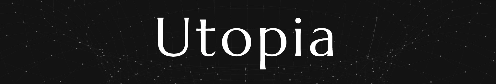

<div align="center">



</div>

# Utopia

<div align="center">

[Philosophy](#philosophy) · [Quick start](#quick-start) · [Features](#features) · [Roadmap](#roadmap)

[](https://github.com/deeplethe/utopia/stargazers)
[](LICENSE)
[](https://www.rust-lang.org)

[](https://utopia.bi)
[](https://github.com/deeplethe/utopia/pkgs/container/utopia)
[](https://github.com/deeplethe/utopia/discussions)
[](https://github.com/deeplethe)
[](README.zh-CN.md)

</div>

**The enterprise world model built by [DeepLethe](https://deeplethe.com).** It is the first open substrate for knowledge engineering that learns passively and governs itself. Where a knowledge graph or a vector store works to hold present knowledge, Utopia puts time awareness and ontology in the base layer: the knowledge system evolves as material arrives, and conflict detection, reasoning and decision making all run against that ontology. It deploys offline, so a company can stand up a knowledge foundation, a decision core its agents can trust, and a compliance audit trail on hardware it controls.

> Please note: we would rather this project were not framed as an open-source take on Palantir. It is **a different route to enterprise intelligence, built bottom up from knowledge governance to trustworthy decisions and simulation**.

---

<!-- Video: drop an mp4 into any issue/PR comment box, GitHub returns a
     https://github.com/user-attachments/assets/xxx link,
     paste that link on its own line here and it renders as a player. -->

<div align="center">

https://github.com/user-attachments/assets/aa226443-75de-437e-bd80-88e592ed8457

</div>

---

## Philosophy

We gave it a somewhat romantic name, **Utopia**. Ptolemy's geocentric model was taken for truth for a very long time, then falsified step by step by Copernicus, Kepler, Galileo and Newton. Looking back, what we keep is not only that heliocentrism turned out to be right; it is how that history unfolded.

Where existing vector stores and knowledge graphs work to get present knowledge right, one of Utopia's founding aims is to record the whole course of changing understanding. Engineered, that becomes a **bitemporal knowledge graph**. When a decision is reviewed later, the system can produce the full course it took and the grounds it rested on. To make this hold up in practice we have iterated at length against public corpora spanning enterprise records, education, finance, law and research. Temporality is only one facet; for how knowledge is taken in, how the future is reasoned about, and how logic bounds action, see [utopia.bi/philosophy](https://utopia.bi/philosophy).

## Features

The system is a Rust binary and a Postgres service. pgvector and a queue-table design keep the stack and its service dependencies light.

| | |
|---|---|
| **A complete application** | A system console, a graph browser and an ontology workbench that runs in the browser. Install it and it works; there is no library to assemble first. |
| **Knowledge ingest** | PDF, DOCX, PPTX, XLSX/XLS/ODS, CSV/TSV, Markdown, HTML and plain text, with legacy text encodings detected on the way in. Web pages, RSS, GitHub and Jira sync on a cron; anything else pushes in with a per-source token. Failed parses reprocess in place, and a whole source or base can be re-extracted in bulk. |
| **Search and chat** | Hybrid retrieval over Tantivy full-text and pgvector, fused with RRF; Chinese full-text uses jieba tokenisation. Answers stream with inline citations that jump straight to the source passage. Any OpenAI-compatible endpoint works (DeepSeek, Qwen, GLM, Ollama, vLLM), so the whole system can run on an isolated network. |
| **Agent harness and agentic RAG** | The application is itself a harness: the whole system can be driven through conversation. The built-in agent carries tools for document search, entity lookup, fact and change history, and querying a mounted database, and calls them over several turns before it answers. |
| **Ontology and cold start** | A base ships with no vocabulary of its own. Cold start comes from packs: schema.org, W3C Org, PROV-O, FOAF and IOF Core, gzipped into the binary and chosen at creation ([ask for your industry](https://github.com/deeplethe/utopia/issues/new?labels=enhancement&title=Ontology%20pack%20request)). Vocabulary met outside them is recorded with a source quote and a count, and frequent items merge in on confirmation, so the ontology grows with the corpus. |
| **Bitemporal graph** | Extraction against the editable ontology produces entities and facts, each carrying a validity interval and its evidence rows. Correcting a fact closes the old version and links the new one to it rather than overwriting. Queries read back at any point in history, and the entity panel shows both timelines at once: when something held in the world, and when the system changed its mind. |
| **Entity resolution and review** | Three-stage entity resolution; every merge is logged and can be undone. Low-confidence extractions, merge candidates and cardinality conflicts go to a review queue rather than interrupting anyone. Confirming, rejecting or closing a fact by hand leaves a record. |
| **Reasoning and derivation** | Rules are expressed in temporal Datalog and driven by forward chaining. Derived facts carry validity and provenance like extracted ones, and their derivation path expands all the way back to the original sentence. Ontology axioms (type inheritance, relation hierarchy, transitivity, symmetry, inverses, disjointness, cardinality) compile into rules and take part in reasoning. |
| **Conflict detection** | Three checks, three different verdicts. Temporal conflicts resolve to closing the old fact, keeping both, or rejecting the new one. Axiom violations in the data (self-loop, asymmetry, transitive cycle, cardinality) resolve to retracting the fact, relaxing the axiom, or accepting both. Defects in the ontology itself come first, because violations computed on a self-contradictory ontology are noise. |
| **Ontology-driven querying** | Register a Postgres connection once, mount it on a base, and chat queries documents and the database together. An exploration pass reads the mounted schema against the concepts already in the base and proposes mappings; the agent proposes, a person confirms. The method behind it ([Ontology2SQL](https://github.com/deeplethe/ontology2sql)) is state of the art on BIRD Mini-Dev for both SQLite and PostgreSQL ([submission](https://github.com/bird-bench/bird-bench.github.io/pull/218)). |
| **Multi-user and permissions** | Permissions are scoped per knowledge base, each with its own members and roles. Open bases are readable by everyone in the deployment, restricted ones only by invited users. A deployment has one system administrator, the first account registered, and each base carries owner, admin, editor and viewer roles. |
| **Decision ledger** | Confirming and rejecting facts, merging and reverting entities, rebuilding the graph: all of them leave a record with the operator, the time, and a snapshot of the object as it then stood. The record remains queryable after the object is invalidated or rebuilt. |
| **[Decision intelligence (in development)](#roadmap)** | Recording decisions, replaying both the understanding and the course a decision took, and reasoning over overlaid scenarios. |

## Quick start

Requirements: Docker (local development also needs Rust 1.85+, Node 20+, pnpm).

Start from the prebuilt image:

```bash
git clone https://github.com/deeplethe/utopia.git
cd utopia
docker compose --profile app up -d
```

Open http://localhost:1516 and register. The first account automatically becomes the administrator, and a public knowledge base readable by everyone is created at the same time. Before extracting business documents, configure the model endpoints (chat and embedding) under system settings.

Or build from source:

```bash
docker compose -f docker-compose.yml -f docker-compose.build.yml --profile app up -d --build
```

### Local development

```bash
# 1. Postgres with pgvector
docker compose up -d db

# 2. Backend on :1516, runs migrations on startup
cargo run -p utopia-server

# 3. Frontend on :5173, proxying /api to the backend
cd web && pnpm install && pnpm dev
```

## Roadmap

- [ ] **Decision reasoning**: constraint computation, and replaying a decision after the fact
- [ ] **Execution gate**: checking an agent's calls against ontology rules and symbolic logic
- [ ] **Lakehouse for mapping and querying**: mapping exploration and Ontology2SQL over Iceberg / Delta Lake, Databricks, Snowflake and MaxCompute
- [ ] **More sources**: MySQL, ClickHouse and Doris drivers; S3, WebDAV, Notion and Feishu connectors
- [ ] **Time to the moment**: an `instant` precision beside year / month / day, for sources that carry a real timestamp. Today a connector rounds it to a UTC day, which can shift an event across midnight by one day
- [ ] **Agent memory over MCP**: episode writes, the retrieve endpoint, and the MCP server
- [ ] **Enterprise**: OIDC SSO, backup and restore commands, benchmarks at 100k documents

## Status

Utopia is still at **v0.1**. The database schema evolves between versions and migrations only roll forward, with no rollback. Pin a specific version with `UTOPIA_IMAGE` in production, and back up the database along with the `data` directory before upgrading.

Please read [SECURITY.md](SECURITY.md) before exposing it to the public internet.

## Star History

<div align="center">

<picture>
  <source media="(prefers-color-scheme: dark)" srcset="https://raw.githubusercontent.com/deeplethe/utopia/assets/assets/star-history.svg">
  
</picture>

</div>

## Community

- 💬 [Discussions](https://github.com/deeplethe/utopia/discussions): discussion, experience reports and reviews
- 🐛 [Issues](https://github.com/deeplethe/utopia/issues): any bug, design question or request
- 🤝 [Contributing](CONTRIBUTING.md): dev setup, the checks to run before pushing, DCO sign-off
- 🔌 [Ontology2SQL](https://github.com/deeplethe/ontology2sql): the ontology-driven text-to-SQL method referenced above

## License

[Apache-2.0](LICENSE)
