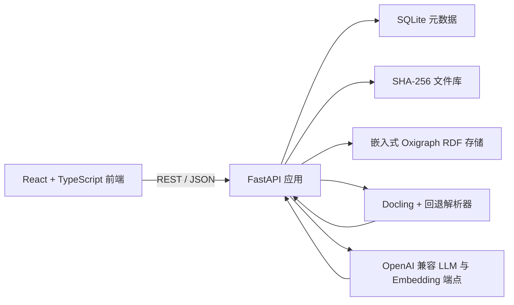

<div align="center">

# OntoPilot

**将文档转化为可审阅、可追溯的本体。**

OntoPilot 是一套本地优先的 RDF/OWL 知识建模工作台，通过人工参与的 AI 流程完成文档解析、
本体抽取、审阅校正、验证和发布。

[English](README.md) · [简体中文](README.zh-CN.md)


</div>

## 项目简介

OntoPilot 的目标不是生成一次性的 LLM 输出，而是把源文档逐步转化为经过审阅的知识本体。
系统将结构感知文档解析、模式与实例抽取、语义检索、专用审阅智能体、溯源、人工编辑和可回滚
历史整合在一个自托管应用中。

文档、元数据和本体图默认保存在本地。只有用户选择的文档分块和相关本体上下文会发送到管理员
配置的 OpenAI 兼容模型端点。

## 核心能力

| 领域 | 能力 |
| --- | --- |
| 文档接入 | PDF、Word、Excel、Markdown、CSV 和文本；内容寻址存储；虚拟文件夹 |
| 结构化分块 | 原生 Docling 层级与表格感知分块，并提供轻量解析回退 |
| TBox 抽取 | 类、子类、对象属性、数据属性、定义域、值域和公理 |
| ABox 抽取 | 个体、类型、对象断言、数据断言和来源证据 |
| 智能体辅助 | 本体检索、实体消歧、定义域/值域协调、冲突分流、验证和孤立类挂接 |
| 人工审阅 | 本体冲突、实体消歧和数据类型验证三类专用队列 |
| 溯源 | 每条抽取公理和事实都可回溯到源文档及文本分块 |
| 本体工作台 | 类层级、聚焦邻域图、全图、检查器、明细表和 LaTeX 公理展示 |
| 治理 | 知识体系级 owner/editor/viewer 权限、审计历史和按图回滚 |
| 互操作 | 导出 Turtle、RDF/XML、N-Triples 或 JSON-LD |

## 系统架构



每个知识体系拥有两张 Oxigraph named graph：

- **TBox 图**：保存类、属性和模式公理；
- **ABox 图**：保存个体和断言。

SQLite 保存用户、权限、文档、分块、抽取任务、溯源、冲突、历史决策和审计事件。原始文件按
SHA-256 内容寻址，只在本地文件库中保存一份。

## 典型流程

1. 创建知识体系并选择模型端点。
2. 上传和整理源文档。
3. 将文档解析为结构感知分块。
4. 通过后台任务抽取模式、实例或两者。
5. 审阅冲突、歧义实体匹配和验证问题。
6. 在本体工作台中浏览和编辑知识图。
7. 将实体和断言回溯到原始文档。
8. 导出本体，或回滚某次修改前的图状态。

## 使用 Docker 快速启动

### 前置条件

- Docker Engine 与 Docker Compose
- OpenAI 兼容 API Key，例如 OpenRouter Key

### 启动

```bash
git clone https://github.com/deeplethe/ontopilot.git
cd ontopilot
cp backend/.env.example backend/.env
```

PowerShell 使用：

```powershell
Copy-Item backend/.env.example backend/.env
```

编辑 `backend/.env`，至少设置：

```dotenv
OPENROUTER_API_KEY=sk-or-v1-your-key
ADMIN_USERNAME=admin
ADMIN_PASSWORD=replace-with-a-strong-password
```

启动应用：

```bash
docker compose up -d --build
```

打开 <http://localhost:8080>，使用 `backend/.env` 中的管理员账号登录。

停止服务但保留数据：

```bash
docker compose down
```

运行数据保存在 `ontopilot-data` Docker volume 中。

为控制镜像体积，基础 Docker 镜像默认使用轻量回退解析器。如需在 Docker 中启用 Docling 的层级与表格感知流程，请在自定义后端镜像中加入可选 Docling 依赖后重新构建。

## 本地开发

### 环境要求

- Python 3.12+
- Node.js 22+
- pnpm
- OpenAI 兼容 API Key

### 后端

```powershell
cd backend
python -m venv .venv
.venv\Scripts\Activate.ps1
pip install -r requirements.txt
```

Docling 在基础依赖中是可选项。要启用层级与表格感知解析，请安装：

```powershell
pip install "docling>=2.118,<3" "docling-core[chunking]>=2.90,<3"
```

复制并配置环境文件：

```powershell
Copy-Item .env.example .env
```

启动 API：

```powershell
uvicorn app.main:app --host 127.0.0.1 --port 8000 --reload
```

- 健康检查：<http://127.0.0.1:8000/api/health>
- OpenAPI 文档：<http://127.0.0.1:8000/docs>

### 前端

```powershell
cd frontend
pnpm install
pnpm dev
```

开发服务器运行在 <http://localhost:5173>，并将 `/api` 代理到后端。

### 校验命令

```powershell
# 后端语法检查
cd backend
.venv\Scripts\python.exe -m compileall -q app

# 前端检查
cd ..\frontend
pnpm lint
pnpm build
```

## 配置

系统从 `backend/.env` 读取基础配置。管理员也可以在运行时管理模型端点，并为每个知识体系设置
独立覆盖配置。

| 变量 | 默认值 | 说明 |
| --- | --- | --- |
| `OPENROUTER_API_KEY` | 空 | 默认 OpenRouter 连接的 API Key |
| `OPENROUTER_BASE_URL` | `https://openrouter.ai/api/v1` | 默认 OpenAI 兼容基础地址 |
| `LLM_EXTRACT_MODEL` | `deepseek/deepseek-chat` | 默认抽取与智能体模型 |
| `EMBEDDING_MODEL` | `baai/bge-m3` | 默认多语言 Embedding 模型 |
| `LLM_TEMPERATURE` | `0.1` | 模型采样温度 |
| `LLM_MAX_TOKENS` | `4000` | 最大输出 Token 数 |
| `CHUNK_SIZE_TOKENS` | `900` | Docling HybridChunker 分块预算 |
| `EXTRACTION_MODE` | `auto` | `rag`、`agentic` 或自动选择 |
| `EXTRACTION_CONCURRENCY` | `5` | 单个任务并发抽取分块数上限 |
| `ADMIN_USERNAME` | `admin` | 空数据库首次启动时创建的管理员用户名 |
| `ADMIN_PASSWORD` | `admin` | 初始管理员密码，必须覆盖 |
| `COOKIE_SECURE` | `false` | HTTPS 部署时设为 `true` |
| `CORS_ORIGINS` | 本地 Vite 地址 | 允许访问后端的浏览器来源 JSON 列表 |

全部高级智能体和验证参数见 `backend/app/config.py`。

## 抽取模式

- **RAG**：检索相关本体实体与邻域，通过一次模型调用完成抽取。
- **Agentic**：允许模型在受限工具循环中搜索本体和查看邻域，再输出本体增量。
- **Auto**：小型本体使用 RAG，达到配置的类数量阈值后使用 Agentic 模式。

TBox 分块并发处理，图写入串行化，从而保持抽取原子性、任务进度可查询和回滚差异一致。

## 溯源与安全删除

OntoPilot 将本体视为多个来源合并后的产物。同一条公理或事实可能由多个文档共同支撑，也可能来自
人工编辑。

删除文档前，系统会计算影响范围并找出仅由该文档支撑的内容。用户必须确认这些撤回项。仍有其他
来源支撑或由人工创建的内容会保留，从而避免误删图谱和遗留无来源事实。

## 数据与隐私

本地开发时的运行数据位于 `backend/data/`：

```text
backend/data/
├── blobs/          # 内容寻址源文件
├── ontopilot.db    # SQLite 元数据、用户、任务、溯源和审计历史
└── oxigraph/       # 持久化 RDF named graph
```

该目录和 `backend/.env` 均已被 Git 忽略。

重要隐私说明：

- 用户选中的文档分块和相关本体上下文会发送给配置的模型服务商；
- Provider API Key 只保存在服务端，API 不会返回未遮罩的 Key；
- 非本地部署必须使用 HTTPS，并设置 `COOKIE_SECURE=true`；
- 备份时应同时备份 SQLite、文件库和 Oxigraph，以保持跨存储一致性。

## 部署边界

当前版本面向单机自托管后端。SQLite、嵌入式 Oxigraph、进程内后台任务和图写锁均针对本地优先
场景设计，目前不支持横向扩容和分布式持久任务。

## 目录结构

```text
ontopilot/
├── backend/
│   ├── app/api/          # FastAPI 路由
│   ├── app/db/           # SQLModel 元数据与迁移
│   ├── app/llm/          # OpenAI 兼容模型客户端
│   ├── app/ontology/     # RDF 存储、抽取、智能体、验证和溯源
│   ├── app/parsing/      # Docling 集成与回退分块
│   ├── app/storage/      # 内容寻址文件库
│   └── scripts/          # 评估与压力测试工具
├── frontend/
│   └── src/              # React 应用、页面、组件和类型化 API 客户端
└── docker-compose.yml
```

## 路线图

- 后端、前端和端到端自动化测试
- 持久化抽取 Worker 与可恢复任务
- 版本化数据库迁移
- 更严格的 OWL-DL 推理集成
- 在可视化工作台中直接创建图关系
- 可复现的 Python 依赖锁定和公开容器镜像

## 参与贡献

项目目前由 DeepLethe 组织以私有预览形式维护。仓库向外部贡献者开放前，将补充贡献指南、Issue
模板和公开治理规则。

## 许可证

项目尚未选择公开开源许可证。当前仓库保留全部权利，不得重新分发。在仓库转为公开前，必须用选定
的开源许可证替换 `LICENSE`。

## 致谢

OntoPilot 基于 FastAPI、React、Docling、Oxigraph、RDFLib、pySHACL 和 RDF/OWL 生态构建。
