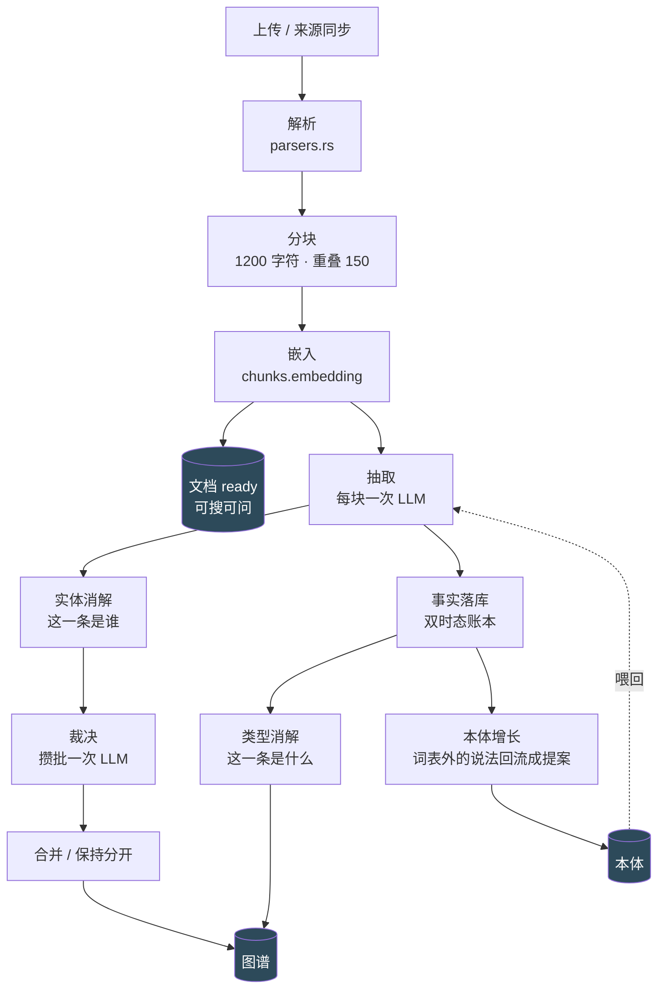
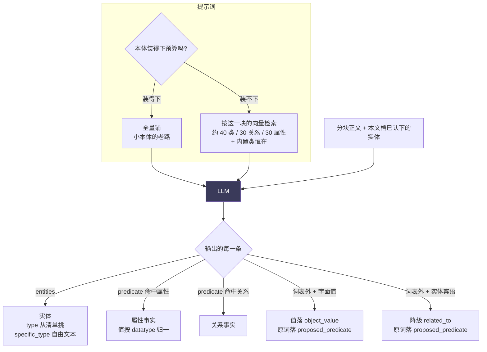
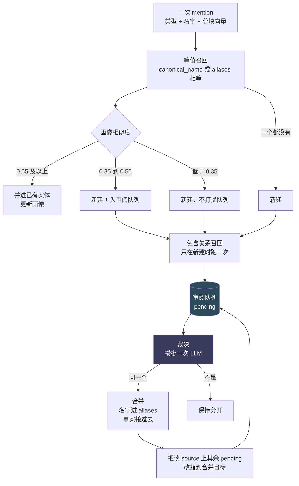
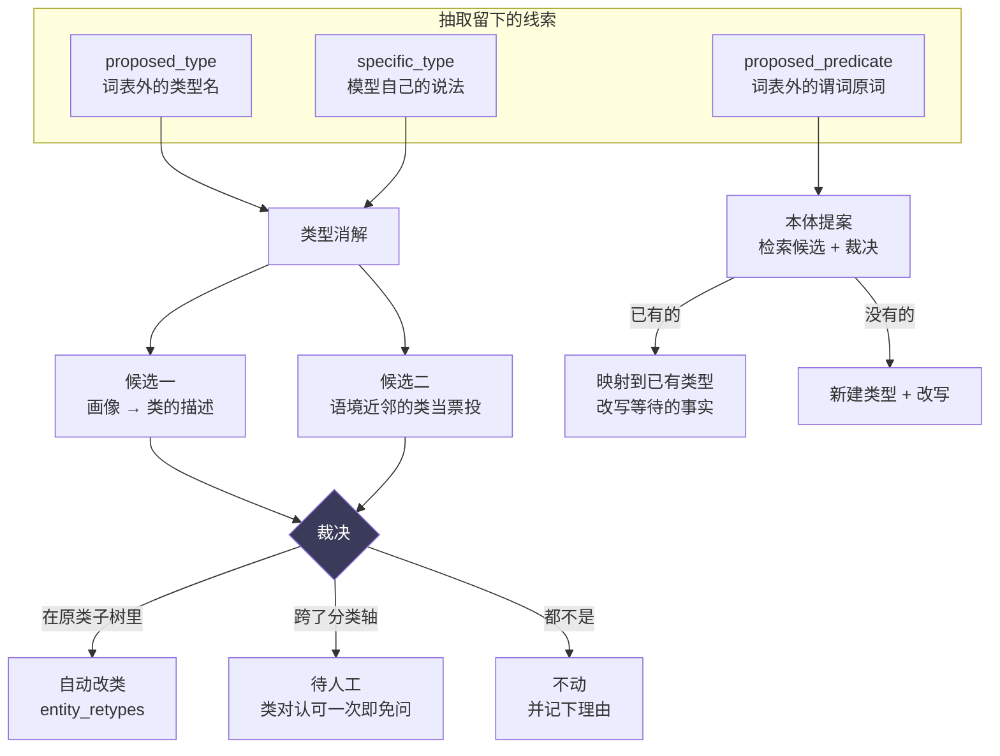

# 一份文档如何变成图谱

**这一篇不讲为什么，讲东西怎么流的。** 「为什么这样而不是那样」在 [decisions/](decisions/README.md)；
这里回答另一个问题：**我改的这一行，处在整条链的哪个位置，它上游给我什么、我不给下游什么会断在哪。**

> 图上最值钱的不是箭头，是**箭头断掉的地方**。每一段末尾都有一节「这里会丢东西吗」，
> 列的是代码里真实存在的丢弃点与它们在库里的落点——不是"理论上可能失败"，
> 是**已经在 `extraction_drops` 里数得出来的那几种**。

## 全景



**两段式是有意的**：嵌入完成即 `ready`，搜索与问答立刻可用，抽取在后台排队。
一篇长文档的图谱要几分钟才长出来，但它在几十秒内就能被搜到。

**本体那条回流虚线是这套东西的循环**：抽取用本体，抽取遇到本体没有的说法就把原词记下来，
提案回流补进本体，下一批文档的抽取就用上了。见 [0003](decisions/0003-ontology-growth-loop.md)。

---

## 一、抽取一个分块



**`specific_type` 是这一步最容易被忽略的输出**：自由文本、不校验、不入本体，就是模型自己
对这个实体的说法（"vector database software"）。类型消解靠它把任务从「读懂这是什么」
换回「本体里哪个类叫这个名字」。没有它，实测 17 个实体的 `proposed_type` 全是空的——
因为清单里总有个"差不多"的，模型选了它，心里那个更准的说法就此丢失。

**词表外的两条路都不丢东西**：带字面值的落 `object_value`（而不是凭空造一个叫「2015」的实体），
带实体宾语的降级成 `related_to`。两者的原词都进 `fact_evidence.proposed_predicate`，
那是这条事实身上唯一还留着原意的地方。

### 这里会丢东西吗

会。七种，全部记进 `extraction_drops`，界面上可见：

| 原因 | 什么时候 |
|---|---|
| `low_confidence` | 模型自报置信度低于阈值 |
| `subject_not_declared` | 属性事实的主语没在 `entities` 里声明，类型不明、domain 无从校验 |
| `attr_domain_mismatch` | 属性挂到了 domain 之外的类上（沿父类上溯仍不匹配） |
| `attr_no_value` / `attr_datatype` | 属性事实没给值，或值换算不出声明的 datatype |
| `object_missing` | 关系事实没有宾语 |
| `fallback_relation_missing` | 本体里连兜底关系都被删了 |

**`attr_domain_mismatch` 是最贵的一种**：它在落地当场丢弃，而事后改类救不回来——
那条事实从没写入过，只能重抽。

---

## 二、实体消解：这一条是谁



**三个阈值分三档**（`SIM_ATTACH = 0.55`、`SIM_NEW = 0.35`）：像得没话说就并，
像得可疑就新建但入队，不像就新建且不打扰队列。**宁分勿合**——错合的代价是两个实体的
事实混在一起，比多一个实体贵得多。

**包含关系召回**（`Holmes` ⊂ `Sherlock Holmes`）补等值召回的盲区：前缀枚举不完，
简称会静默变成第二个实体。它有三条约束：较短那个名字至少 4 字符（低于此多是通名）、
单次最多产出 4 对、SQL 侧多扫 16 行（硬互斥类型在 Rust 侧才筛得掉）。

**改指那一步**是整张图里最不直觉的一环，也是最容易被误删的：合并之后，涉及被合实体的
其余待审阅对**不能关掉**，要改指到合并目标。理由见下。

### 这一段修过三个洞，三个都是同一份语料照出来的

用《福尔摩斯冒险史》前六篇（`scripts/bench/corpora/holmes.json`）连跑四次，每次修一层：

| | 原始 | 修同类型 | 加别名召回 | 加改指 |
|---|---|---|---|---|
| 已合并实体 | 14 | 37 | 47 | **57** |
| `Holmes` 并入 | ✗ | ✓ | ✓ | ✓ |
| `Mr. Holmes` 并入 | ✗ | ✗ | ✗ | **✓** |

**第一层**：`classify_type_drift` 没有「两个类型相同」这一档，`person × person` 落进
`Disjoint`——"永不可能是同一个"。那个函数生来服务「类型漂移」（同名被抽成两种类型），
那里两边相同不会发生；后来被包含关系召回借去当相容性判据，**而那里两边相同才是常态**。
全文最明显的同指关系一对都没进过队列，十二个既有单元测试全在测跨类型。

**第二层**：召回只看 `canonical_name`。合并把名字搬进 `aliases`，于是**每成功合并一次
就拆掉一条桥**——`Holmes` 并入之后，后来的 `Mr. Holmes` 跟 `Sherlock Holmes` 谁也不含谁，
本来正是靠 `Holmes` 桥接。修好第一层反而让第二层的漏显形了。

**第三层**：合并会把涉及被合实体的其余 pending 审阅关成 `superseded by merge`，
代码注释里的理由是"疑点若仍在会由后续 mention 重新提起"。**那句是错的**：包含关系召回
只在新建实体时跑，而这些实体早就存在、不会再被新建。关掉即永久关闭。现在改指到合并目标，
只有两类真正过时的才关——重定向后成自环的，和目标对已在队列里的。

**这三层是一层套一层的**：不修第一层看不见第二层，不修第二层看不见第三层。
基准语料的价值不在第一次跑出的数字，在**每修一次就再照出下一层**。

### 这里会丢东西吗

不会丢事实，但会**留下不该分开的实体**。两个已知缺口：

- 两个名字既不互相包含、又没有共同别名做桥（`启明 X7 加速卡` vs `启明 X7 推理加速卡`）。
  要三元组相似度，而 `CREATE EXTENSION pg_trgm` 需要超级权限，本仓库是受限角色连库。
- 单次包含关系召回上限 4 对：一个通名可能被几十个实体包含，全放进去会淹掉队列。

合并本身**可撤销**（`entity_merges` 记着改之前的一切，`revert_merge` 放回去）。

---

## 三、本体消解：这一条是什么



**两路候选取并集，不合分数。** 距离在三处都不可比：跨实体不可比
（`清华大学计算机系→computer_store` 0.46 比 `星云科技→corporation` 0.59 还近，而前者荒谬）、
两路之间不可比（一个在类空间一个在实体空间）、同一路的两个查询之间也不可比
（短查询"医药集团"产生的距离系统性小于一整段画像）。**一律交替取。**

**分档不看模型自报的 confidence**——实测是双峰的（15 条全 ≥0.85、4 条 null，中间没有），
自报置信度是语气不是概率。改用「选中的类在不在原类的子树里」：在 = 往下走一格，自动；
不在 = 换了分类轴，进人工。

**纠正也走人工，而且天然如此**：抽取按块检索候选之后自己就会挑细类，也会挑错
（`绍兴 → address`）；正确答案是错类的**兄弟**不是后代，所以必然判为跨轴。
推翻抽取的判断比细化它风险大，不该自动发生。

### 这里会丢东西吗

不丢事实，但**改类不进时间轴**——它是 `entities` 上一次 UPDATE 加一行 `entity_retypes`，
而实体历史只读 `facts`。所以改错了不会自己显形。**可撤销不等于会被撤销**，
这是先做 preview 再做 apply 的理由。

**拒绝要给理由。** `left_alone` 曾经只是个数，而这一步的设计押在"选择都不是是个体面答案"上——
最大的一档不透明。记上理由之后第一次跑就回答了此前答不出的问题：失败**全在检索一侧**
（`administrative_area`、`periodical` 从没被端上来过），不在裁决。

---

## 想自己跑一遍

`scripts/bench/` 是可重跑的测量台，**每一组一个新库**——复用一个库省几分钟，
换来的是一整段无效结论（那是踩过的坑，不是假设）。

```bash
node scripts/bench/run.mjs --corpus pharma --label seeds-only
node scripts/bench/run.mjs --corpus holmes --label holmes
```

三份语料各测一件事，用途不同、要求也不同：

| 语料 | 测什么 | 有答案键 |
|---|---|---|
| `tech` / `pharma` | 类型准确性 | 有（弱：自己写的） |
| `holmes` | 实体消解 · demo 空镜 | **无，故意的** |

福尔摩斯那份**不该有**准确性答案键：模型早就读过它，量类型准确率量到的是记忆，
不是这条流水线。**编一份假答案比不打分更糟。**

## 相关决策

- [0001](decisions/0001-ontology-import-and-governance.md) 本体导入与治理，含 P3 的实测修订
- [0003](decisions/0003-ontology-growth-loop.md) 本体从语料里长出来，人站在哪一环
- [0006](decisions/0006-ontology-scale-and-the-prompt.md) 本体规模与抽取提示词，含曲线与一次撤回
