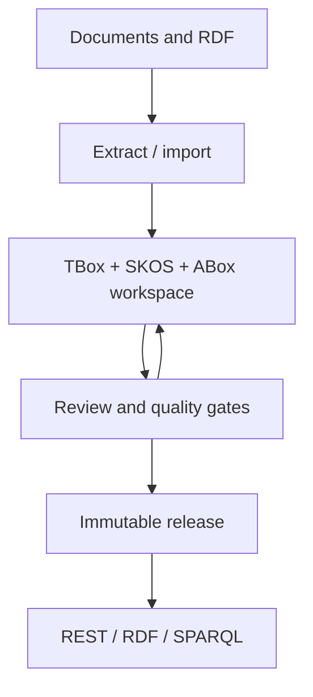

# Capability map

Features participate in one governance chain: source → proposal → review → release → consumption.

| Domain | Capabilities | Output |
| --- | --- | --- |
| Ingestion | PDF, Word, Excel, Markdown, CSV, text, folders, structured chunks | Documents and chunks |
| TBox extraction | Classes, properties, hierarchy, disjointness, equivalence, domains, ranges | OWL/RDFS statements |
| ABox extraction | Individuals, types, object/data assertions, entity resolution | Identities and facts |
| Vocabulary | SKOS schemes, multilingual labels, aliases, hierarchy, mappings | Controlled concepts |
| Human review | Conflicts, resolution, terminology, ABox validation | Decisions and rationale |
| Governance | Roles, prompts, provenance, history, audit, rollback | Explainable change history |
| Release | Draft, review, publish, semantic diff, restore, serving projection | Immutable releases |
| Delivery | Scoped tokens, REST, RDF, read-only SPARQL | Stable read interfaces |

Write capabilities govern the workspace. Production read capabilities should target releases so exploratory edits do not affect applications.
