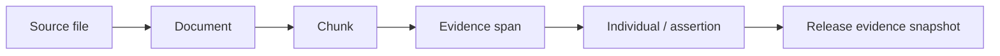

# Instances and provenance

ABox and TBox use separate named graphs so concrete facts do not pollute conceptual structure. Instances remain connected through type and property IRIs.

An individual can contain TBox types, data-property assertions, object-property assertions, and multiple supporting sources. The workspace browses by class, searches identities, and displays relations and evidence. Manual assertion changes also create audit events.

## Multi-source evidence

Multiple documents may support the same identity or assertion, so provenance is a collection rather than a single field. Stable statement keys connect identity, data assertions, and object assertions to evidence.

At release time, provenance is frozen within the release. A token needs `instances:read` to read individuals and the additional `provenance:read` scope to receive document, chunk, and evidence details.
