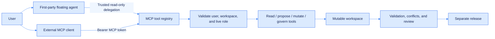

# MCP and agent integration

OntoPilot exposes Streamable HTTP MCP at `/mcp` in the backend lifecycle; no separate process is required. External MCP clients use a token bound to one user and one knowledge system, and every call re-evaluates that user's current role. The built-in first-party agent reuses the current browser user's identity and delegates to the same read-only MCP tools inside the trusted server; the model never sees a cookie or token.



## Create a user MCP token

While signed in, call:

```http
POST /api/knowledge/{ks_id}/mcp/tokens
Content-Type: application/json

{
  "name": "Ontology chat",
  "scopes": ["mcp:read", "mcp:write"],
  "expires_in_minutes": 60
}
```

The `token` secret is returned once. It contains neither the password nor browser session and is valid only for the selected knowledge system. Expiration, revocation, user deactivation, member removal, and role changes take effect immediately.

| Method | Path | Purpose |
| --- | --- | --- |
| `GET` | `/api/knowledge/{ks_id}/mcp/tokens` | List the current user's tokens and status |
| `POST` | `/api/knowledge/{ks_id}/mcp/tokens` | Create a token; the secret is returned once |
| `DELETE` | `/api/knowledge/{ks_id}/mcp/tokens/{token_id}` | Revoke a token immediately |

## Scopes and roles

Token scopes and the live knowledge-system role both apply; effective permission is their intersection.

| Scope | Minimum role | Capability |
| --- | --- | --- |
| `mcp:read` | Viewer | Read ontology, vocabulary, instances, evidence, queues, history, and releases |
| `mcp:write` | Editor | Apply content changes, decide reviews, and start extraction |
| `mcp:manage` | Owner | Publish, roll back, stop services, and perform high-risk lifecycle actions |

Do not give an agent the browser's HttpOnly cookie or place an MCP token in prompts or source code. Inject it through the request header:

```http
Authorization: Bearer opm_<public-id-prefix>_<secret>
```

## Client registration

Client configuration formats vary, but the essential values are:

```json
{
  "mcpServers": {
    "ontopilot": {
      "type": "streamable-http",
      "url": "http://localhost:8080/mcp",
      "headers": {
        "Authorization": "Bearer ${ONTOPILOT_MCP_TOKEN}"
      }
    }
  }
}
```

Set `MCP_PUBLIC_URL`, for example `https://knowledge.example.com/mcp`, when a reverse proxy exposes a different public address.

## Tools

### Reading and evidence

| Tool | Purpose |
| --- | --- |
| `get_workspace_context` | Workspace, live role, statistics, and governance blockers |
| `get_ontology` / `search_ontology` | Read or search the TBox |
| `get_ontology_neighborhood` | Read one exact class/property IRI with its immediate hierarchy, properties, and axioms |
| `list_documents` | Source documents and processing state |
| `list_vocabulary_concepts` / `resolve_term` | Browse and resolve controlled terms |
| `list_individuals` / `get_individual` | Instances, assertions, and source evidence |
| `query_knowledge` | Bounded read-only SPARQL `SELECT` / `ASK` |
| `list_review_items` | Conflicts, entity resolution, terminology, and validation queues |
| `get_conflict_context` | One conflict with its entities, candidate resolutions, and source evidence |
| `get_conflicts_context` | Batch-read up to eight listed conflicts for an efficient ReAct observation step |
| `get_history` / `list_releases` | Audit history and release state |

### Proposals and mutations

| Tool | Purpose |
| --- | --- |
| `preview_ontology_changes` | Validate structured edits and return the exact RDF diff, impact, structural checks, and `base_revision` without saving |
| `apply_ontology_changes` | Pass the preview's `base_revision` as `expected_revision`, then atomically apply edits with actor, reason, and diff audit |
| `apply_instance_change` | Create/delete individuals and add/remove assertions |
| `apply_vocabulary_change` | Manage SKOS schemes and concepts |
| `decide_review_item` | Decide any of the four governance queues |
| `start_extraction` | Start TBox, ABox, or combined extraction |

### Lifecycle

| Tool | Purpose |
| --- | --- |
| `manage_release` | Create, review, publish, deploy, stop, roll back, or delete a release |
| `rollback_history_event` | Reverse one rollbackable audit event |

## Conversational ontology editing

The knowledge-system pages now include a first-party floating agent in the lower-right corner. The knowledge-system ID in the endpoint binds each conversation to that knowledge system; the frontend sends no page section, selected node, or other UI context. Based only on the user's question and conversation, the agent independently chooses which read-only MCP tools to use and continues until the observations are sufficient. It can inspect structure, instances, evidence, review queues, history, and releases; expand the MCP-call trace on an answer to inspect the auditable action/observation summaries. Private model reasoning is not exposed. The overlay does not resize or reflow the ontology canvas.

Workspace counts are routing signals, not answers about the underlying records. For example, a conflict-list question must read `list_review_items`, and conflict-resolution advice must additionally read `get_conflict_context` for one row or `get_conflicts_context` for a batch before it can answer.

The UI never lets the model compose arbitrary RDF, call arbitrary URLs, or execute mutation tools. The agent is limited to evidence → proposal → server preview. A user must inspect the proposal's Semantic Diff and impact in the change preview, then explicitly confirm the atomic commit.

```mermaid
%%{init: {"theme":"base","themeVariables":{"primaryColor":"#dbeafe","primaryTextColor":"#172554","primaryBorderColor":"#2563eb","lineColor":"#3b82f6","secondaryColor":"#eff6ff","tertiaryColor":"#ffffff","fontFamily":"Inter, ui-sans-serif, system-ui"}}}%%
sequenceDiagram
    participant U as User
    participant A as First-party agent
    participant M as OntoPilot MCP
    participant G as Workspace and governance
    U->>A: Describe a domain problem or desired change
    A->>M: Read workspace; search ontology, instances, and evidence as needed
    M-->>A: Current structure, evidence, and revision
    A->>M: preview_ontology_changes(expected_revision=revision)
    M-->>A: RDF diff, impact, structural checks, and base_revision
    A-->>U: Show proposal and impact
    U->>G: Inspect Semantic Diff and impact in the change preview
    U->>G: Confirm commit / cancel
    G->>M: Atomic commit(expected_revision=base_revision)
    M->>G: Write, audit, and re-run structural checks
    G-->>U: Result and remaining review work
```

Start with `get_ontology`, then preview the same `operations` against the returned `revision`. Commit them with the preview's `base_revision`:

`preview_ontology_changes` input:

```json
{
  "expected_revision": "sha256:9f87...",
  "operations": [
    {"op": "add_class", "label": "Ocean Probe", "comment": "A device for ocean observation"}
  ]
}
```

The preview response includes the workspace baseline:

```json
{
  "valid": true,
  "base_revision": "sha256:9f87...",
  "revision": "sha256:be31...",
  "diff": {"counts": {"tbox_added": 3, "tbox_removed": 0}},
  "structural_validation": {"committable": true, "new_error_count": 0}
}
```

After user approval, submit the operations unchanged and pass `base_revision` as the required `expected_revision`:

`apply_ontology_changes` input:

```json
{
  "operations": [
    {"op": "add_class", "label": "Ocean Probe", "comment": "A device for ocean observation"}
  ],
  "reason": "User approved the Ocean Probe class",
  "expected_revision": "sha256:9f87..."
}
```

If another user or agent changes the workspace after preview, apply returns `ontology_revision_conflict` and writes no partial result. Read and preview again; do not force an old proposal by substituting a newer revision.

## Mutation boundaries

- Trusted delegation for the first-party agent can call only MCP tools marked read-only; a model request for a mutation tool is rejected.
- Browser cookies and MCP tokens never enter prompts, tool schemas, tool arguments, or model responses.
- Viewers may explore and receive proposals, but only Editors/Owners can preview and confirm their submission.
- MCP preview and apply reuse the web modeling workbench's atomic executor, so RDF diff, impact, and structural validation have identical semantics.
- Preview runs inside dual TBox/ABox write locks and fully reverts temporary changes.
- `apply_ontology_changes` requires `expected_revision`; a mismatch returns a conflict instead of overwriting concurrent work.
- A TBox batch is one change set; any RDF, audit, provenance, or governance write failure rolls back the whole change.
- Delete, merge, publish, rollback, stop, and release deletion require explicit confirmation.
- Mutations target the mutable workspace; published releases remain immutable.
- Graph writes that conflict with an active extraction are rejected.
- Successful writes record the real user, reason, and rollbackable RDF diff.

External agents should still use a short-lived MCP token created in the knowledge system's API-access area and inject it through a trusted client's request headers. The first-party agent does not mint per-chat tokens; it delegates read-only tools on the server using the current user's live permissions.
