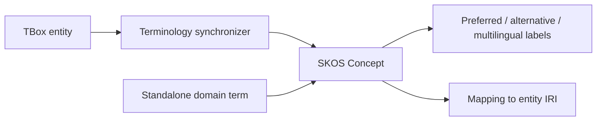

# Ontology and vocabulary

The ontology workspace governs conceptual structure; the vocabulary workspace governs naming. Deterministic synchronization connects them without collapsing the layers.

## Ontology workspace

Graph, table, exploration, and hierarchy views support classes, object/data properties, subclass relations, disjointness, equivalence, domains, and ranges. Search highlights matches and allows keyboard navigation. Standard RDF import and export preserve interoperability.

## Controlled vocabulary

Vocabulary records preferred labels, aliases, hidden labels, languages, broader concepts, ontology mappings, origin, and deprecation state. Combined filters cover status, mapping, origin, and update dates.

TBox edits update mapped concepts while preserving manually governed aliases and standalone terms.

Direct RDF import supports Turtle, RDF/XML, N-Triples, N-Quads, TriG, and JSON-LD. Automatic routing separates schema from individuals; explicit target and write-mode controls remain available.
