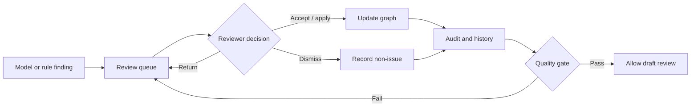

# Review and quality gates

Review is the decision layer between model proposals and governed knowledge. Each queue supports independent status, reviewer, and date-range filters.

| Queue | Purpose | Release blocker |
| --- | --- | --- |
| Conflicts | Duplicate classes, property conflicts, structural contradictions | Unresolved error-level conflicts |
| Entity resolution | Namesakes, merge candidates, identity normalization | All pending items |
| Terminology | Alias, lexical, hierarchy, and mapping proposals | All pending items |
| ABox validation | Individual typing and assertion validity | Error-level items |

Decisions record reviewer, time, rationale, and applied result. Resolved or dismissed findings do not reopen unconditionally; reviewers can revoke a prior decision explicitly.

The quality-gate result is stored in the release manifest so downstream consumers can see which checks the version passed.
