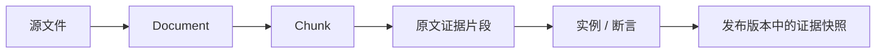

# 实例与溯源

ABox 与 TBox 使用独立命名图，避免具体事实污染概念结构。实例仍通过类型和属性 IRI 与本体连接。

## 实例模型

一个实例可以包含：

- 一个或多个 TBox 类型；
- 数据属性断言，例如额定功率、日期和状态；
- 对象属性断言，例如安装位置、所属系统和关联设备；
- 支持该身份或事实的一个或多个来源。

实例页可按类浏览和搜索身份，并在详情中查看属性、关系与证据。人工增删断言同样会产生审计事件。

## 多来源溯源

多个文档可能共同支持同一身份或同一断言，因此溯源不是单值字段，而是多来源集合。

语句级键用于稳定关联实例、数据断言和对象断言。删除或重建显示层不会让来源关系丢失。

## 发布后的证据

发布时，工作区溯源被固化到 release 范围。下游 Token 只有同时拥有 `instances:read` 与 `provenance:read` 时，实例结果才会包含文档、chunk 和证据片段。

这种设计使业务应用可以只读取事实，也允许审计或解释型应用按需读取来源。
