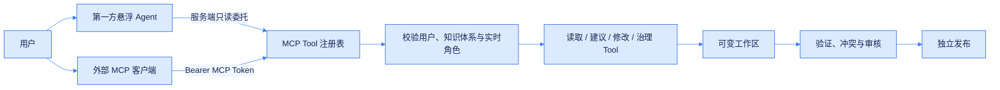
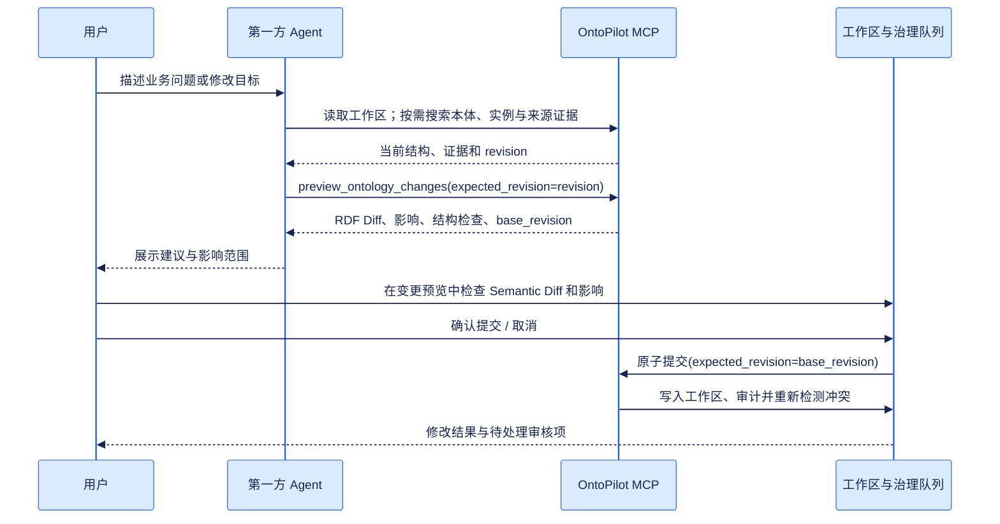

# MCP 与 Agent 集成

OntoPilot 在 `/mcp` 提供 Streamable HTTP MCP。它与后端使用同一个启动周期，不需要部署额外进程。外部 MCP 客户端使用绑定到“用户 + 知识体系”的 MCP Token，每次调用都会重新检查该用户的当前角色。产品内置的第一方 Agent 则复用浏览器当前登录身份，通过服务端可信委托调用同一套只读 MCP Tool，模型始终看不到 Cookie 或 Token。



## 创建用户 MCP Token

登录后调用：

```http
POST /api/knowledge/{ks_id}/mcp/tokens
Content-Type: application/json

{
  "name": "Ontology chat",
  "scopes": ["mcp:read", "mcp:write"],
  "expires_in_minutes": 60
}
```

响应中的 `token` 只返回一次。Token 不保存用户密码或浏览器会话，并且只对创建时选择的知识体系有效。过期、吊销、用户停用、成员移除或角色降低都会立即使不再允许的调用失败。

| 方法 | 路径 | 用途 |
| --- | --- | --- |
| `GET` | `/api/knowledge/{ks_id}/mcp/tokens` | 查看自己的 Token 与状态 |
| `POST` | `/api/knowledge/{ks_id}/mcp/tokens` | 创建 Token；密钥仅本次返回 |
| `DELETE` | `/api/knowledge/{ks_id}/mcp/tokens/{token_id}` | 立即吊销 Token |

## Scope 与用户角色

Token Scope 和知识体系角色会同时生效，最终权限取两者交集。

| Scope | 最低角色 | 能力 |
| --- | --- | --- |
| `mcp:read` | Viewer | 读取本体、词表、实例、来源、审核队列、历史与发布 |
| `mcp:write` | Editor | 应用本体、实例、词表修改，处理审核项，启动抽取 |
| `mcp:manage` | Owner | 发布、回滚、停止服务及其他高风险生命周期操作 |

不要把浏览器的 HttpOnly Cookie 交给 Agent，也不要把 MCP Token 写入提示词或源码。客户端应通过请求 Header 注入：

```http
Authorization: Bearer opm_<public-id-prefix>_<secret>
```

## 客户端注册

不同客户端的配置文件结构可能略有差异，核心参数如下：

```json
{
  "mcpServers": {
    "ontopilot": {
      "type": "streamable-http",
      "url": "http://localhost:8080/mcp",
      "headers": {
        "Authorization": "Bearer ${ONTOPILOT_MCP_TOKEN}"
      }
    }
  }
}
```

反向代理部署时，用 `MCP_PUBLIC_URL` 设置对外地址，例如 `https://knowledge.example.com/mcp`。

## Tool 能力

### 读取与证据

| Tool | 用途 |
| --- | --- |
| `get_workspace_context` | 当前知识体系、用户角色、统计和治理阻塞项 |
| `get_ontology` / `search_ontology` | 读取或搜索 TBox |
| `get_ontology_neighborhood` | 按精确 IRI 读取一个类或属性及其直接上下位、属性和公理邻域 |
| `list_documents` | 查看来源文档和处理状态 |
| `list_vocabulary_concepts` / `resolve_term` | 浏览与解析受控术语 |
| `list_individuals` / `get_individual` | 读取实例、断言与来源证据 |
| `query_knowledge` | 受限只读 SPARQL `SELECT` / `ASK` |
| `list_review_items` | 读取冲突、实体消歧、术语和验证队列 |
| `get_conflict_context` | 读取单条冲突的实体、候选解决方案和来源证据 |
| `get_conflicts_context` | 一次批量读取最多 8 条已列出的冲突，缩短 ReAct 观察步骤 |
| `get_history` / `list_releases` | 读取审计历史与发布状态 |

### 建议与修改

| Tool | 用途 |
| --- | --- |
| `preview_ontology_changes` | 验证结构化修改，返回精确 RDF Diff、影响、结构检查和 `base_revision`，不保存 |
| `apply_ontology_changes` | 携带预览返回的 `base_revision` 作为 `expected_revision`，原子应用修改并记录用户、原因和 Diff |
| `apply_instance_change` | 创建/删除实例，增加/移除断言 |
| `apply_vocabulary_change` | 管理 SKOS 词表与概念 |
| `decide_review_item` | 处理四类审核队列 |
| `start_extraction` | 启动 TBox、ABox 或组合抽取 |

### 生命周期

| Tool | 用途 |
| --- | --- |
| `manage_release` | 创建草稿、审核、发布、部署、停止、回滚或删除发布 |
| `rollback_history_event` | 回滚一个可逆审计事件 |

## 对话式本体修改流程

知识体系页面右下角已经提供第一方悬浮 Agent。Endpoint 中的知识体系 ID 会把对话绑定到该知识体系；前端不会附加页面区域、选中节点或其他界面上下文。Agent 只依据用户问题和对话，自主选择需要调用的只读 MCP Tool，并持续检索直到证据足以回答。它可读取本体结构、实例、来源、审核队列、历史和发布状态；展开回答上的“MCP 调用”即可查看可审计的 Action/Observation 摘要，不会暴露模型的私有思维链。面板覆盖在页面右侧，不会压缩或重排本体画布。

工作区计数只是导航信号，不是底层记录的答案。例如询问“有哪些冲突”时必须读取 `list_review_items`；询问冲突处理方式时，还必须用 `get_conflict_context` 读取单条，或用 `get_conflicts_context` 批量读取相关条目后才能回答。

前端不会让模型直接拼接 RDF、调用任意 URL 或执行写 Tool。Agent 只负责“读取证据 → 提建议 → 服务端预检”，修改建议必须由用户在变更预览中检查 Semantic Diff 和影响，并明确确认后才会原子提交。



先调用 `get_ontology`，再使用其返回的 `revision` 预览同一组 `operations`，最后使用预览结果中的 `base_revision` 提交：

`preview_ontology_changes` 输入：

```json
{
  "expected_revision": "sha256:9f87...",
  "operations": [
    {"op": "add_class", "label": "海洋探测器", "comment": "用于海洋环境探测的设备"}
  ]
}
```

预览响应会包含当前工作区基线：

```json
{
  "valid": true,
  "base_revision": "sha256:9f87...",
  "revision": "sha256:be31...",
  "diff": {"counts": {"tbox_added": 3, "tbox_removed": 0}},
  "structural_validation": {"committable": true, "new_error_count": 0}
}
```

用户确认后，原样提交修改，并把 `base_revision` 传为必填的 `expected_revision`：

`apply_ontology_changes` 输入：

```json
{
  "operations": [
    {"op": "add_class", "label": "海洋探测器", "comment": "用于海洋环境探测的设备"}
  ],
  "reason": "用户确认新增海洋探测器类",
  "expected_revision": "sha256:9f87..."
}
```

如果预览后工作区已被其他用户或 Agent 修改，提交会返回 `ontology_revision_conflict`，且不会写入部分结果。此时应重新读取并预览，不能用新的 revision 强行重放旧建议。

## 修改安全边界

- 第一方 Agent 的服务端委托只允许调用标记为只读的 MCP Tool；即使模型请求写 Tool，也会被拒绝。
- 浏览器 Cookie 和 MCP Token 都不会进入提示词、Tool Schema、Tool 参数或模型响应。
- Viewer 可以探索和获得建议，但只有 Editor/Owner 能预览并确认提交建议。
- MCP 预览与提交复用网页建模工作台的同一个原子执行器，因此 RDF Diff、影响分析和结构校验语义一致。
- 预览 Tool 会在 TBox/ABox 双图写锁内临时执行并完整回滚，不产生持久修改。
- `apply_ontology_changes` 强制校验 `expected_revision`；revision 不一致时返回冲突，不覆盖并发修改。
- 批量本体修改按一个变更集执行；任何 RDF、审计、来源或治理写入失败都会撤销整个变更。
- 删除、合并、发布、回滚、停止和删除发布要求显式确认参数。
- 修改只进入可变工作区；已发布版本保持不可变，发布是独立动作。
- 抽取运行期间会拒绝冲突的图写入，避免交叉修改。
- 所有成功写入都会记录真实用户、修改原因和可回滚 RDF Diff。

外部 Agent 仍应使用知识体系 API 访问区域签发的短期 MCP Token，并由可信客户端通过 Header 注入。第一方 Agent 不签发会话 Token：它只在服务端使用当前用户的实时权限委托只读 Tool。
