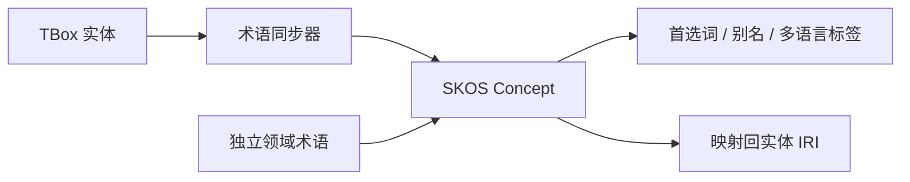

# 本体与术语

本体页关注概念结构，术语页关注命名治理。两者存在确定性同步关系，但不会合并为同一份数据。

## 本体工作台

本体支持图谱、表格、探索与层级全景等视图。用户可以：

- 创建、编辑和删除类；
- 管理对象属性与数据属性；
- 检查上下位、互斥、等价、定义域和值域；
- 从图节点查看入关系、出关系和子类；
- 使用搜索高亮并在匹配项间切换；
- 导入或导出标准 RDF。

## 受控术语

术语页维护词表、首选词、别名、隐藏检索词、语言、上位概念、本体映射和弃用状态。列表支持搜索，以及状态、映射、来源和更新时间的组合筛选。

术语来源分为自动形成、人工创建和 AI 建议后确认。来源字段用于理解术语如何进入词表，不等同于审核状态。

## 确定性同步

当 TBox 新增或修改实体时，同步器会更新对应 SKOS 概念；人工维护的别名和独立术语不会因此被覆盖。

## RDF 互操作

系统支持 Turtle、RDF/XML、N-Triples、N-Quads、TriG 与 JSON-LD。自动导入模式依据 RDF 语义把 schema 写入 TBox、实例写入 ABox，也可以显式指定目标层和写入策略。
