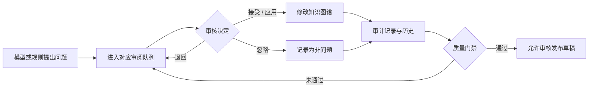

# 审阅与质量门禁

审阅页是模型提案进入受治理知识图谱前的决策层。四类队列分别处理不同的不确定性，并可按状态、审核人和时间范围独立筛选。

| 队列 | 处理内容 | 阻塞发布的条件 |
| --- | --- | --- |
| 冲突 | 重复类、属性冲突、结构矛盾 | 未解决的 error 级冲突 |
| 实体消歧 | 同名、候选合并、身份归一 | 所有待处理项 |
| 术语提案 | 别名、词形、层级和映射建议 | 所有待处理项 |
| ABox 验证 | 实例类型与断言合法性 | error 级验证项 |

## 决策流程

决定会记录审核人、时间、理由和应用结果。已解决或已忽略的问题不会在下一次检测时无条件重新打开；用户也可以主动撤销历史决定，让候选重新进入审阅。

## 质量门禁

质量门禁在草稿进入“已审核”之前执行。它聚合四类队列，而不是只检查某个页面的数字。门禁结果会写入发布 Manifest，使下游能够知道该版本通过了哪些检查。

> “没有待办”不等于本体绝对正确，但它意味着当前已知的严重冲突和待裁决提案都已经得到明确处理。
